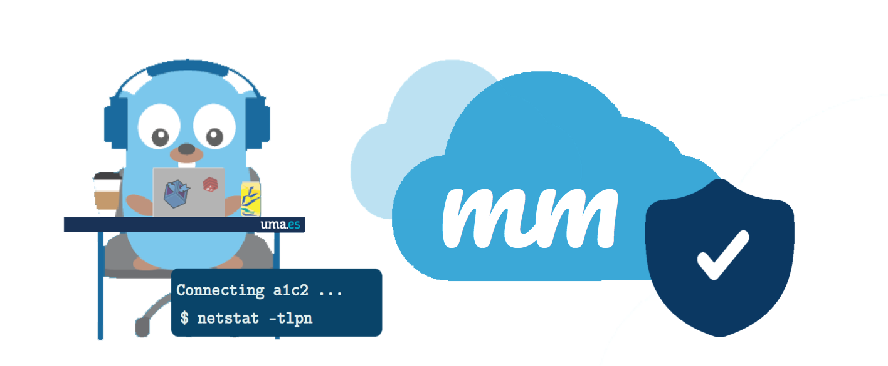
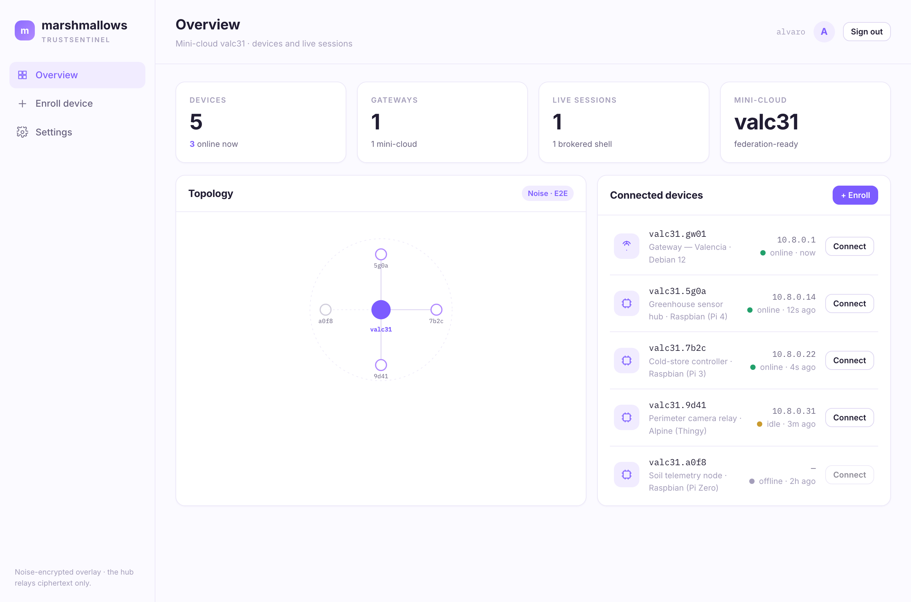
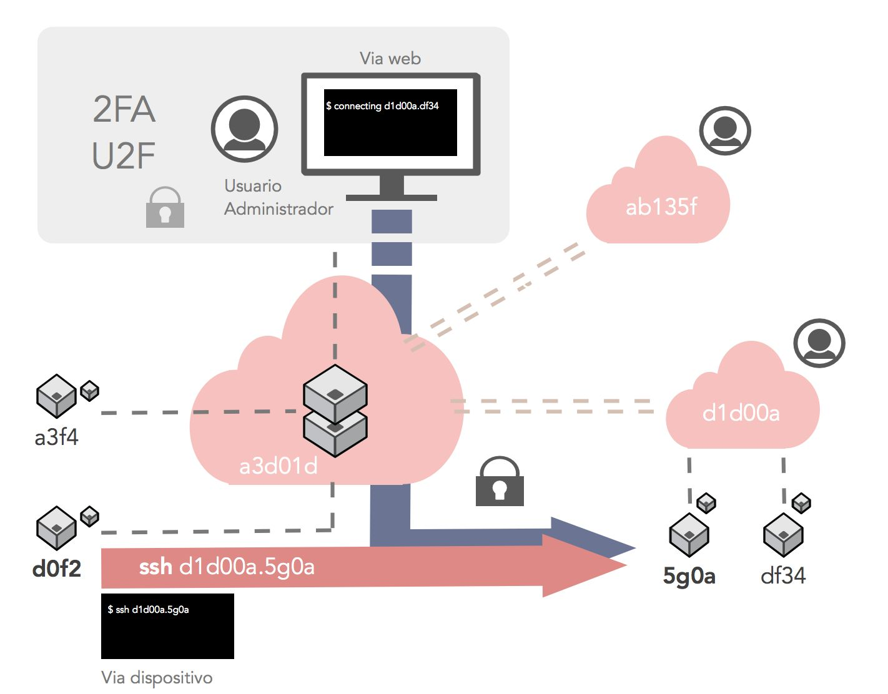

# marshmallows

  

Secure mesh networking for IoT — an encrypted peer overlay that makes separate private clouds mutually reachable, hardened with lightweight crypto and 2FA/U2F.

  <code>Status: Active</code> · <code>Go · React · Noise Protocol</code> · part of <a href="https://trustsentinel.eu">TrustSentinel</a>

  

  🏆 Recognized at the <b>INCIBE National Cybersecurity Competition 2019</b> — a lightweight-cryptography secure-mesh architecture for IoT.

 

  

  <b>The marshmallows dashboard</b> &nbsp;·&nbsp; mini-cloud topology &nbsp;·&nbsp; device management &nbsp;·&nbsp; a Noise-encrypted browser terminal

 

## Overview

marshmallows is a Platform-as-a-Service for managing and securely connecting IoT
devices. Each deployment runs as a self-contained **mini-cloud** that IoT devices
attach to; separate mini-clouds — on different networks or infrastructures — can
associate with one another so their devices become mutually visible and reachable,
according to the privileges each administrator defines.

Its goal is **SSH access to any connected device from anywhere** in the
infrastructure — from a classic terminal or from the web dashboard — without users
needing to know IP addresses that may change over time. Every device is catalogued
with an alphanumeric identifier; its address is registered with an intermediary
**broker** that verifies access permissions and brokers the connection between
machines.

As a proof of concept, each platform ships a customized Debian image for Raspberry
Pi, and could target low-power *Thingy*-class devices. It's an ideal way to manage
and segment devices into domains by function or by whatever criteria the operators
choose.

  

## Components
- **[broker/](broker)** — the coordinator: registers devices, verifies permissions, and brokers end-to-end links between machines.
- **[agent/](agent)** — the device-side agent (Go, Noise Protocol transport).
- **[web/](web)** — the React dashboard (browser terminal + device management).
- **[auth/](auth)** — the authentication API (2FA/U2F identity).

## Objectives
1. **Manage devices across separate deployments** without them having to be
   individually identified on the network.
2. **SSH management between devices, or from the web portal** — which requires a
   broker that provides a protected end-to-end link.
3. **Interconnect several marshmallows nodes** so their devices are visible and
   reachable across mini-clouds, linked via a web-hook mechanism between brokers.

## Advantages
- **Cost** — lightweight provisioning, no added overhead.
- **Scalable & flexible** — new devices are recognised automatically, named, and
  offered for connection.
- **Location-independent** — reach a device without knowing where it sits on the
  network, so devices stay flexible and mobile.
- **Performance** — communication is lightweight *and* secure, leaving the device
  free to spend its resources on its actual job.
- **Security** — traffic is brokered over lightweight, secure channels; protected
  by the **Noise Protocol Framework** with end-to-end Diffie-Hellman encryption.
- **Maintenance** — devices can move from one cloud to another and be reassigned a
  different IP without the end user noticing.

## What makes it different
- **Reinforced authentication** — physical-key login via Yubico/FIDO keys (U2F),
  or OTPs.
- **Runs on any infrastructure** — physical networks, local networks, or Docker
  containers.
- **Secure comms via NPF** ([Noise Protocol Framework](https://noiseprotocol.org/)),
  avoiding the overhead and heavy keys of TLS.
- **Human-friendly identifiers** — each element gets an alias scoped by cloud and
  device (`cloud_id.device_id[.service_id]`), e.g. `d1d00a.5g0a` or `d1d00a.5g0a.ssh`.

## Internals
End-to-end secure channel and agent flow:

  
  &nbsp;
  

## Tech stack
- **Back end** — Go and Ruby
- **Data** — Redis & MySQL
- **Web framework** — Rails (auth API) + React (front end)
- **2FA** — Google Authenticator (TOTP)
- **U2F** — Yubico / FIDO keys

## Design & vision
See **[docs/iot-mesh-architecture.md](docs/iot-mesh-architecture.md)** — how
marshmallows grows into a Tailscale-class mesh purpose-built for constrained/edge
devices. It sits alongside the wider TrustSentinel estate: it seeds the Go Noise
agent used by [stk](https://github.com/trustsentinel/stk), and its mesh model
feeds the [netso](https://github.com/trustsentinel/netso) connectivity platform.

## License
MIT — see [LICENSE.md](LICENSE.md).

Originally prototyped at bluebycode/marshmallows (CyberCamp / INCIBE 2019);
continued under TrustSentinel. Translated from the original Spanish and updated.
