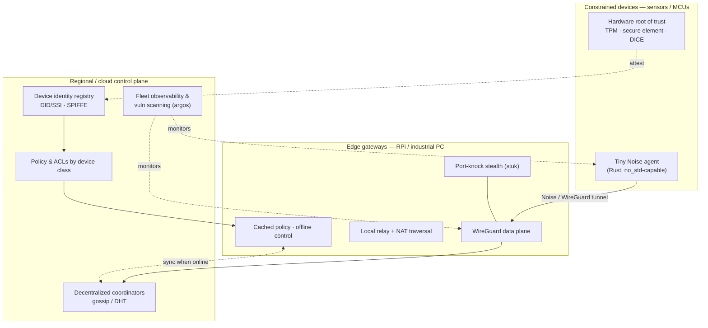

# A secure mesh for IoT & edge — architecture & vision

> marshmallows began (2019) as a lightweight secure-mesh overlay for IoT, built on
> the Noise Protocol with 2FA/U2F. This document reframes it as a **Tailscale-class
> mesh purpose-built for constrained and edge devices** — and how the rest of the
> TrustSentinel portfolio composes into it.

## Why not just Tailscale?

Tailscale and marshmallows share a crypto core — Tailscale's data plane is
WireGuard, and WireGuard's handshake *is* the Noise protocol (Noise_IK), the same
family marshmallows uses. The difference is everything around the tunnel, and
Tailscale is optimized for **laptops, servers, and human identity**. IoT/edge
breaks several of its assumptions:

| Assumption in general mesh VPNs | Reality at the IoT/edge |
|---|---|
| Fat client (Go stack) is fine | MCUs need a tiny agent (KBs, not MBs) |
| Humans authenticate via SSO/OAuth | Devices need hardware-rooted identity + attestation |
| Full-mesh tailnet | IoT is hub-and-spoke / hierarchical |
| Always-on connectivity | Devices sleep; cellular/LoRa; lossy links |
| Control plane always reachable | The edge must keep working offline |
| Devices are physically safe | Devices get stolen/cloned → revoke fast |

## Target architecture

Three tiers, with identity, stealth, and observability as cross-cutting concerns.

### Data plane
- **Edge gateways:** WireGuard (kernel where available) — proven, fast, tiny.
- **Constrained devices:** a **minimal userspace Noise transport** in Rust
  (`no_std`-capable) reusing WireGuard's Noise_IK — drop the heavy client stack.
- Peer-to-peer where reachable; **local edge gateways act as relays** (not just a
  distant cloud DERP), so latency and egress stay low.

### Control plane — hierarchical & offline-tolerant
- Regional coordinators / edge gateways **cache policy** so a site's mesh keeps
  running when the cloud is unreachable (the biggest gap vs centralized control).
- Coordination is **decentralized** (gossip/DHT) rather than one server —
  directly applies the P2P/decentralized-network research behind `argos`.

### Identity — hardware-rooted, zero-touch
- Device identity anchored in a **TPM / secure element / DICE**; issued as
  **DID/SSI** or SPIFFE SVIDs (this is exactly `netso`'s domain).
- **Remote attestation** + short-lived certs + instant revocation.
- **Zero-touch onboarding:** a device powers on, attests, and receives identity +
  policy automatically — no human SSO.

### Stealth by default
- Devices expose **no open ports** — `stuk`-style **port-knocking** means they're
  invisible to scanners until a valid, authenticated knock. A property general
  mesh VPNs don't offer, and a strong fit for exposed field devices.

### Transport-agnostic
- Runs over Wi-Fi, cellular, LoRa, or constrained links; can tunnel control over
  MQTT/CoAP for delay-tolerant, low-power operation.

### Observability & posture
- `argos` continuously maps the fleet — location, ASN/ISP, software, and **known
  vulnerabilities** — so the mesh knows its own security posture, not just its
  topology.

## Differentiators vs Tailscale/WireGuard

1. **MCU-class agent footprint** (not a fat client)
2. **Hardware-attested device identity** + zero-touch (not human SSO)
3. **Offline-tolerant, hierarchical control** (edge survives cloud outage)
4. **Stealth by default** (port-knocking — no discoverable ports)
5. **Transport-agnostic** (cellular / LoRa / constrained)
6. **Built-in fleet vulnerability scanning**
7. **Self-hostable / sovereign** (industrial IoT data residency)

## How the TrustSentinel portfolio composes

| Capability | Project |
|---|---|
| Mesh overlay + agent | **marshmallows** |
| Stealth access (port-knocking) | **stuk** |
| Noise broker / browser access to any device | **stk** |
| Device identity (DID/SSI, E2E) | **netso** |
| Fleet observability & vuln scanning | **argos** / **kuipeers** |

No single competitor combines **stealth + hardware identity + offline-tolerant
edge control + built-in security posture**. That's the wedge.

## Prior art to learn from (don't reinvent)
- **Nebula** (cert-based mesh, lighthouse relays, decentralized data plane) — closest to IoT/edge; strongest base to build on.
- **ZeroTier** (L2 overlay, existing IoT focus).
- **Headscale / NetBird** (self-hosted Tailscale-style control).
- **WireGuard** (raw data plane).

**Strongest synthesis:** Nebula's cert model + hardware attestation (netso) +
offline-tolerant decentralized control + argos observability + stuk stealth.

## Roadmap (proposed)
1. **Spike:** minimal Rust Noise agent on an MCU + a WireGuard edge gateway; measure footprint.
2. **Identity:** device DID/SSI issuance + attestation PoC (netso).
3. **Control:** offline-tolerant policy cache at the edge; gossip sync.
4. **Stealth:** integrate stuk port-knocking on device exposure.
5. **Observability:** argos fleet view + vuln posture.
6. **Compare:** benchmark vs Nebula/Tailscale (footprint, join time, offline behavior).

_Draft — 2026-09-02. Discussion doc, not a commitment._
